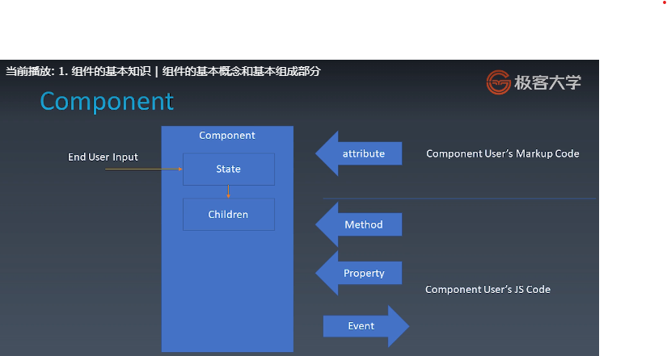
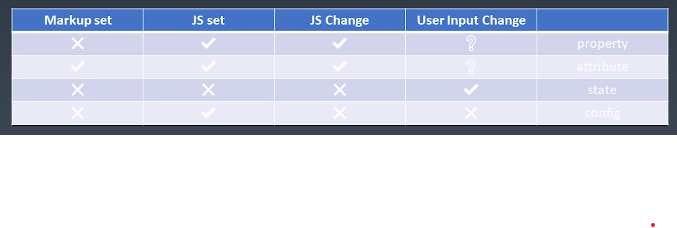
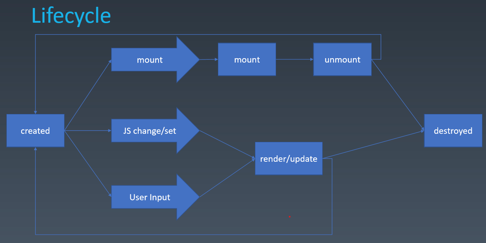

学习笔记

# 1. 组件化

## 1.1 概述

组件化是前端架构最重要的一个部分。另一个是架构模式（如MVC，MVVM等，专注在前端跟数据逻辑层的交互）。

组件化是从扩展html标签扩展出来的，主要的目标是复用。好的组件化更改提升前端团队的复用率。

## 1.2 组件的基本概念和组成部分

组件，模块，对象的区别？

概念上侧重不同。组件是跟UI强相关的。它是一种特殊的模块，或者特殊的对象。可以以树形结构来组合。

组件和对象的具体区别？

对象：属性（Properties），方法（methods）和继承关系（inherit，原型继承）

组件：除此之外还有attribute（它跟properties的差别再展开），config（构造函数里面的东西） & state（组件的状态），event（组件往外去传递东西，ui相关的一般都会有这种event的需求），lifecycle（生命周期），children（属性结构的必要性）。加的这些东西其实从实现来看都是可以从对象的那三个东西来描述，但是它从语义的高度来描述这些东西增加的组件对于大型系统的适应性。 



上图左边是用户对组件的影响，可以通过一些ui的交互，修改组件的state，从而影响它的children

右边是程序员在制作组件的时候对组件的影响。首先是attribute和property的区别，attr是由markup语言来实现，一般就是html语言。property是由js语言来实现。attr强调描述性。property强调从属关系。在html的例子

```
Attribute:
<my-component attribute="v" />
myComponent.getAttribute("a")
myComponent.setAttribute("a", "value")

Property:
myCompoenent.a = "value"
```

行为上的区别

```
<div class="cls2 cls2"></div>
<script>
var div = document.getElementByTagName("div")
div.className // cls1 cls2
</script>
```

```
<div class="cls2 cls2" style="color:blue"></div>
<script>
var div = document.getElementByTagName("div")
div.style // 对象
</script>
```

上例中attr是字符串，prop是语义化之后的对象

还有个著名的坑，input组件的value。input.getAttribute('value')得到的它的attr，直接访问得到的是prop，比如input.value。若prop没有设置，input.value的值是attr的值，如果已经设置，则attr不变，prop变化。元素的实际效果是prop优先。

Property vs attribute vs state vs config



state: 为了保证state的一致性。state最后由用户的输入更改。使用component的人最好不要更改state

config: 全局性的，一致性的设置，之后不可更改，一般放在构造函数

生命周期(lifecycle)

created到destroyed的中间过程。



Children的两种类型，一种是所见即所得的content型children，一种是template型的children。通过变量传进来，最后才能知道有多少实际的children

## 1.3 JSX语法

从零开始建立一个组件系统。首先要有markup和js都能访问的环境，所以第一步要建立一个能够使用markup的环境。一种是类react的jsx环境，一种是类似vue的标记语言的parser的环境。

因为jsx的解析工作是babel的插件完成的，而babel一般作为loader的形式放在webpack中使用，所以我们依次要安装的包有webpack, webpack-cli, babel-loader, @babel/core, @babel/preset-env, @babel/plugin-transform-react-jsx

webpack的基本功能能够把import或者require的各种js文件打包为一个js文件。babel能够把各种新版本的js转为兼容性更好的js。

